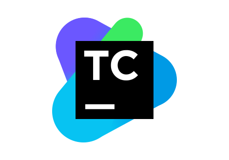

### About me

- 💼 I'm QA Engineer
- 🌱 I’m currently learning at QA.GURU
- 📫 How to reach me: Telegram @tmaksyutov

### Tools and technologies:

  <code></code>
  <code></code>
  <code></code>
  <code></code>
  <code></code>
  <code></code>
  <code></code>
  <code></code>
  <code></code>
  <code></code>
  <code></code>
  <code></code>
  <code></code>
  <code></code>
  <code></code>
  <code></code>

## My projects:
### :heavy_check_mark: UI Autotests for Runc website

### :heavy_check_mark: API Autotests for reqres website
